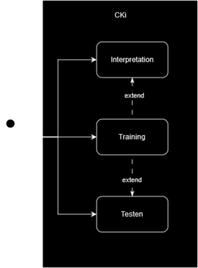
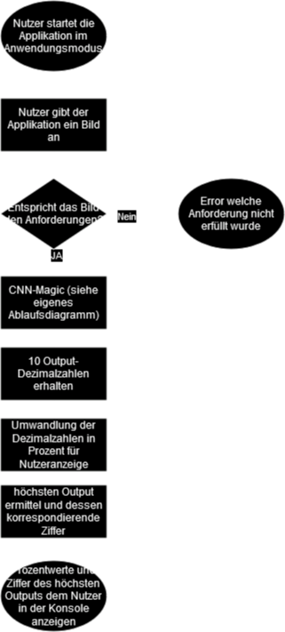
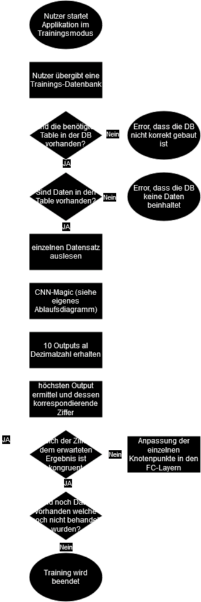
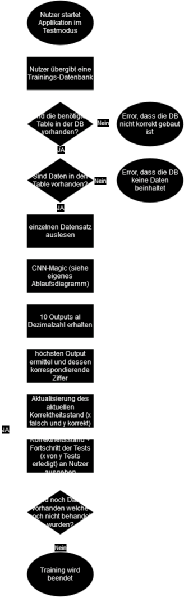

# Analyse
## Zielgruppe
Das Projekt CKi ist als solches nicht ausgelegt einen realen Anwendungszweck zu entsprechen oder eine Lösung oder eine Lösungsansatz für einen solchen zu bieten. Diesbezüglich liegt der einzige Nutzen von CKi nicht in dessen Produkt sondern nur im Wissensgewinn und Verständnisgewinn für den Entwicklern in den Bereichen der künstlichen Intelligent oder genauer im Bereich des maschinellen Lernens mit einem _Convolutional Neural Network_, der Realisation von Anwendungen mit C++ und dessen Möglichkeiten Hardware direkt in die programminternen Abläufe einzubinden. Somit richtet sich CKi nicht nach dem Grundsatz ein bestmögliches nutzbares Produkt zu sein, sondern lediglich nach dem grössten Wissensgewinn für den Entwickler. Nach diesem Grundsatz ist die resultierende Zielgruppe der Entwickler und vereint so multiple Rollen des Projektes CKi in einer Person.

## Anforderungen
### Must-Have's
Die Must-Have's wurden aus dem Themenblatt welches am 15.09.2023 bei Walter Schnyder eingereicht wurde übernommen und mit weiterführenden Elaborationen versehen.
+ _Rückgabe in Prozentwerten, die die Wahrscheinlichkeit der Übereinstimmung mit dem digitalen Gegenstück der handgeschriebenen Zahl abbildet -> Welche Zahl wurde, vermutlich aufgeschrieben_
> ***Erläuterung:*** Da ein simples neuronales Netzwerk für maschinelles Lernen durch ein "Netz" aus Knotenpunkten gebaut wird und jeder dieser Knotenpunkte, auch die Knotenpunkte, welche bei einem solchen neuralen Netzwerk als Endschnittstellen fungieren, einzeln berechnet werden, erhält man, bei Anwendungsfall von CKi, eine multiple Anzahl von Prozentzahlen welche zur Interpretation es gelieferten Endergebnisses verwendet werden können. Diese Rückgabe der einzelnen Prozentwerte erfolgt zum beginn über einen Konsolenausgabe. Diese wir später wie in *"Nice-To-Have's"* unter GUI erläutert in ein grafisches Nutzerinterface integriert und zu diesem Zeitpunkt evtl. auch interpretiert (wobei die einzelnen Prozentwerte weiterhin einsichtig bleiben sollten).
+ _CNN-Algorithmus (trainiert auf Zahlenwert)_
> ***Erläuterung:*** Ein CNN-Algorithmus oder auch Convolutional Neural Network wird beim maschinellen Lernen oft bei der Interpretation von Bildern genutzt. Dabei wird das Bild in kleiner Abschnitte unterteilt und "einzeln" an den gehirnähnlich aufgebauten Algorithmus weitergegeben. \
Im Projekt CKi wird dieser wie im Themenblatt beschrieben mit  Bild von einzelnen Handgeschriebenen Ziffern trainiert.
+ _Nutzer-Input -> Nutzer darf eine Zahl zeichnen_
> ***Erläuterung:*** Ein solches CNN-Model zu erbauen und zu trainieren ist zwar die Grundlage für dieses Must-Have jedoch sollte das Produkt auch erprobbar sein. Diesbezüglich muss der Nutzer in der Lage sein eine handschriftliche Ziffer an das neurale Netzwerk zu liefern. Hierbei ist die minimale Anforderung, dass der Nutzer in einer anderweitigen Applikation ein solches Bild erstellt hat und es nun interpretieren lassen kann. Wie in *Nice-To-Have's* unter GUI beschreiben wird diese Eingabemöglichkeit (eine Ziffer zu zeichnen oder eine schon vorhandene grafische Abbildung zu verwenden) in einem weiteren Entwicklungsschritt direkt in die grafische Nutzeroberfläche des Applikation integriert.

### Nice-To-Have's
Die Nice-To-Have's wurden aus dem Themenblatt welches am 15.09.2023 bei Walter Schnyder eingereicht wurde übernommen und mit weiterführenden Elaborationen versehen. Zudem behalte ich mir als Verfasser dieses Dokumentes, als Entwickler des Projektes CKi und als Zielgruppe des Projektes CKi vor diese Liste in gegebenen Falle zu erweitern.
+ _GUI_
> ***Erläuterung:*** Ein GUI oder auch Graphical User Interface ist die grafische Nutzeroberfläche der Applikation. Da die Applikation primär dem Wissensgewinn gewidmet ist und dementsprechend nicht für den Nutzer optimiert wird, hat eine solche Erweiterung nur eine geringe Priorität. Dieses Nutzeroberfläche wird selbst bei Umsetzung in einer möglichst simplen Form gehalten. Dabei sollte es folgende Bestandteile beinhalten:
>
> + Eine Möglichkeit für den Nutzer eine anderweitig gezeichnete Ziffer interpretieren zu lassen
> + Eine Möglichkeit für den Nutzer eine Ziffer zu zeichnen
> + Eine weiter-interpretierte Ausgabe der Interpretation des CNN
> + Eine Ausgabe der uninterpretierten Prozentwerte der Interpretation des CNN 
> 
>Bis zu dem Punkt, wo ein GUI realisiert wurde und in den Einsatz gestellt wird, sind nicht alle dieser Funktionen über die Konsole (das Interface zum Programm welches vor dem GUI zum Einsatz kommt) verfügbar.
+ _GPU als Berechnungsplattform nutzen_
> ***Erläuterung:*** Die CPU in jedem Computer ist eine sehr "fokussierte" Hardware, immer nur einen einzelnen Prozess kann diese berechnen. Dies ist für ein neuronales Netzwerk, welche hunderte oder tausende von Knotenpunkten in seinem Netzwerk hat und alle einzeln berechnet werden müssen, äusserst hinderlich. Die dezidierte Grafikkarte, wenn vorhanden, kann diesem Geschwindigkeitsverlust nachhelfen, da eine solche GPU in der Lage ist tausende Berechnungen gleichzeitig zu tätigen.\
> Da im Projekt mit C++, einer Hardware-nahen Programmiersprache, gearbeitet wird kann eine Anbindung an das Rechenpotential der GPU erreicht werden. Da dies jedoch ein äusserst schwieriger Prozess ist, sich diese Anbindung bei den unterschiedlichen Herstellern von GPUs unterscheiden kann und ich notwendig um ein funktionierendes CNN zu erstellen, wurde diese Optimierung als nicht notwendig eingestuft.

### Use-Cases
Die hier aufgelisteten Use-Cases entsprechen den Use-Cases nach den Must-Have's und sind diesbezüglich ohne die grafische Nutzeroberfläche. Dies kann dazu führen, dass ein endgültiges Produkt nicht mehr kohärent zu den Use-Cases steht. Im Allgemeinen sollte aber selbst eine solche Inkohärenz nicht in extremer Weise auftreten, da die Bedienung der Applikation als Konsole als auch als grafische Oberfläche in ähnlicher Weise auftreten sollte. 

| Nummer | Name | Akteur | Beschreibung | Ablauf| Vorbedingung | Nachbedingungen | Ausnahmen | Anmerkungen
|---|---|---|---|---|---|---|---|---|
| 1 | Interpretation | Nutzer, CNN | ... | Siehe Ablaufdiagramme "Interpretation" |  | Der Nutzer sollte in der Konsole eine Auflistung aller möglichen Ziffern (0-9) und deren entsprechenden Wahrscheinlichkeit sehen. Zudem kann der Nutzer auch die kongruierende Zahl zur höchsten Möglichkeit auf einer speziellen Zeile in der Konsole ablesen. | Bei der Interpretation von Nutzer-eigenen Abbildungen kann es zu multiplexen Fehlern kommen. Diese reichen von falschen Dateikodierung zu falschen Auflösung. Aufgrund dieser mannigfaltigen Möglichkeiten zu Fehlern können diese nicht alle hier erläutert werden. Eine Auflistung aller Fehler ist in der Dokumentation unter "*Fehler*" zu finden. | Offiziell ist zwar Training keine Vorbedingung zu Testet, jedoch macht die Anwendung der Applikation keinen Sinn, wenn man nicht erwarten kann, dass man ein realistisches oder sinnvolles Ergebnis erhält. |
| 2 | Training | Nutzer, CNN | ... | Siehe Ablaufdiagramme "Training" |  | Der Nutzer erhält nach der Beendigung der Schulung des CNN-Model eine kurze Benachrichtigung dass das Training abgeschlossen ist. Zudem erhält der Nutzer nach jedem einzelnen Datensatz den Output, dass nun x von y Datensätzen bearbeitet wurden.  | Hierbei kann es zu zwei Fehlern kommen. Dabei handelt es sich beides, um Fehler bei der Datenbank. Der erste ist ein Fehler wenn die benötigten "Tables" in der Datenbank nicht stimmig mit den Erwartungen sind und der andere wenn keine Daten in der Datenbank zu finden sind. Für die genauen Fehlercode ist die Dokumentation unter "*Fehler*" zu kontaktieren. |
| 3 | Testen | Nutzer, CNN | ... | Siehe Ablaufdiagramme "Testen" |  | Der Nutzer findet nach jedem Datensatz, in der Test-Datenbank eine simple Gegenüberstellung der richtigen und der falschen interpretierten Ziffern. Diese weiter zu verarbeiten ist dem Nutzer überlassen. Dies hat auch einen technischen Hintergrund, da keine bzw. möglichst wenig Rechenleistung in die Nutzerausgabe verschwendet werden soll. Neben der Gegenüberstellung erhält der Nutzer auch die Benachrichtigung dass nun x von y Datensätzen bearbeitet wurden. Zudem erhält der Nutzer eine kurze Benachrichtigung in die Konsole, wenn alle Test-Datensätze verarbeitet worden sind. | Hier kann es zu zwei Fehlern kommen. Dabei handelt es sich beides, um Fehler bei der Datenbank. Der erste ist ein Fehler wenn die benötigten "Tables" in der Datenbank nicht stimmig mit den Erwartungen sind und der andere wenn keine Daten in der Datenbank zu finden sind. Für die genauen Fehlercode ist die Dokumentation unter "*Fehler*" zu kontaktieren. | Bei Den Testdaten, würde es evtl. Sinn machen die einzelnen Konsolen Outputs auch in einer CSV-Datei festzuhalten, wobei dies mit Pipes in der Konsole dem Nutzer bereits offen steht.   Offiziell ist zwar Training keine Vorbedingung zu Testet, jedoch macht das Testen nur begrenze Sinn, wenn es noch nichts gibt, was sich zu testen lohnt. |

### Use-Case Diagramm

### Ablaufdiagramme
#### Interpretation

#### Training

#### Testen

#### CNN-Magic
Das Ablaufdiagramm eines CNN wurde durch ein externes Bild ersetzt, da dieses die Abläufe in einem CNN besser und konkreter visualisiert.

## Umsetzung
Wie im Themenblatt vom 15.09.2023 wird für die Umsetzung reines C++ verwendet.
### Entwicklungsumgebung
Bei der Entwicklungsumgebung wird das JetBrains Produkt **CLion** zum Einsatz kommen. Dieses beinhaltet alle benötigten Funktionalitäten die bei der Entwicklung des Produktes nötig sind. Gegebenen Falles könnte noch **SQLite Browser** zur Verwendung kommen, da dieses ein besseres (und für den Entwickler ein gewohnteres) Interface zur Handhabung von lokalen Datenbanken bietet. Für die Version Control des Projektes wird lokal **Git** verwendet und zur Sicherung in der Cloud wird sowohl **GitHub** als auch **GitLab** verwendet. Die Entwicklungsumgebung mit IDE und Version Controll wird primär auf dem Betriebssystem Windows verwendet. Es kann jedoch nicht garantiert sein, dass die Entwicklung nicht teilweise unter einer Distribution von Linux ablaufen wird. Hierbei sollten (evtl.  abgesehen von der GUI) keine Kompatibilitätsprobleme mit sich führen. 
### CNN
#### Grundlagen
Der Kern des CNN lässt sich in drei unterschiedliche Arten von Schichten aufteilen. Zusätzlich gibt es noch zwei zusätzliche "Hilfs-"Schichten welche für den In- und Output zuständig sind. 
Die *Eingabeschicht* ist einer dieser zwei erwähnten Schichten. Diese akzeptiert im Falle von CKi jeweils ein Bild von speziel definierter Grössen und nimmt gibt jeden Pixel in Graustufen (Dies ist entscheidend weil so der Farbwert des Pixels von drei zwei Byte grossen Zahlen zu nur einer zwei Byte grossen Zahl reduziert wird.) als ein sogenanntes Eingabeneuron. 
Auf die Eingabeschicht folgt die *Convolutional Layers* oder auch *Faltungsschichten*. Diese Faltungsschichten ist einer der Schlüsselbestandteile eines CNN. Die Convolutional Layers dienen dazu bestimmte Merkmale und Schlüsselelemente aus dem Bild zu extrahieren. Hierbei wird bei jedem der Convolutional Layer eine 
mathematische Faltungsoperationen durchführt. 
Nach den Faltungsschichten kommen die simplen *Pooling-Schichten*. Bei einer Pooling-Schicht wird die Dimension eines Bildes reduziert (Downsampling). Dies kann durch zwei Arten geschehen entweder durch Max-Pooling, dabei wird aus einer Liste von Werten nur der höchste übermittelt oder durch Durchschnitts-Pooling wobei der Durchschitt dieser Liste berechnet und übermittelt wird. Durch diese Datenreduktion wird Rechenleistung gespart und so das Ergebnis schneller und stabiler geliefert. 
Vor der Ausgabeschicht gibt es noch die *FC layers* oder auch *Vollständig verknüpfte Schichten*. Bei diesen ist jeder Knotenpunkt mit jedem Knotenpunkt in der nächsten Schicht verbunden. Dies ist das Herz des gesamten Models. Dabei wird in jedem Knotenpunkt ein neuer Wert berechnet um in der letzten Schicht, der *Ausgabeschicht* diese in Wahrscheinlichkeit zu "konvertieren".
#### Implementation
Bei der Implementation eines CNN-Models wurde für CKi der Entschluss getroffen eine C++-Klasse für jede benötigte Art von Layer zu schreiben. Danach muss ein Grundgerüst, eine Main-Klasse realisiert werden, die alle Klassen mit einander kombiniert. Dies erleichtert es in einem späteren Schritt die grosse Umstellung von einer Konsolen-Anwendung hinzu einer grafisch passierten Anwendung (auch wenn immer noch grosse Teiler der Main-Klasse ausgetauscht werden müssen.). Für die Speicherung der Berechnungswerte für die FC Layers ist die Abwegung zu treffen, ob es sinnvoll ist diese in einer lokalen Datenbank zu speichern oder in eine konkret hierfür entworfene Datei zu schreiben.
### Testdaten
Die Testdaten für CKi können in unzähliger Ausführung auf [Kaggle](https://www.kaggle.com/) gefunden werden.
#### Speicherung
Im gegebenen Fall würde es für die Schulung des CNN Sinn ergeben die einzelnen Bilder nicht über Ordner- oder Archivstrukturen zu speichern sondern in eine oder mehrere lokale Datenbanken abzuspeichern.
### Quellen
[Geekflare](https://geekflare.com/de/convolutional-neural-networks/)\
[IBM](https://www.ibm.com/topics/convolutional-neural-networks)\
[Medium](https://towardsdatascience.com/a-comprehensive-guide-to-convolutional-neural-networks-the-eli5-way-3bd2b1164a53)

## Nutzwertanalyse der Lösungsvarianten
### Alternativen
Die möglichen Alternativen zu einer kompletten Realisation eine CNN oder irgendeinem neuronalen Netzwerk in C++ ohne Bibliotheken oder Frameworks für neuronale Netze sind endlos. 
Selbst wenn man bereits bestehende Produkte begutachtet wird man auf GitHub schnell fündig. Bei einer Suche auf GitHub mit dem Query "mnist digit recogniser" findet man nach Stand 20.10.2023 02:13 178 Repositories (je eines in C, C++, C#, Rust, drei in Java + Kotlin und 53 in Python).
Selbst wenn man unter dem Beschluss steht, dass man das CNN selber bauen wolle, würde man für jede beliebige Sprache eine Bibliothek oder Framework finden die einem diese Aufgabe erleichtern würde.
### Kosten
Bezüglich der Kosten kann das Projekt CKi nicht mit den Alternativen mithalten. C++ ist keine Sprache in welcher man schnell ein Produkt hervor bringt. Dies belegen etliche Studien und Artikel ([Programming Languages Table](https://www.cs.bsu.edu/homepages/dmz/cs697/langtbl.htm), [An Empirical Comparison of
Seven Programming Languages](https://citeseerx.ist.psu.edu/viewdoc/download?doi=10.1.1.113.1831&rep=rep1&type=pdf), [Programming Languages by Energy Efficiency](https://haslab.github.io/SAFER/scp21.pdf), [Development time in various languages](https://stackoverflow.com/questions/1894453/development-time-in-various-languages))
Zudem, dass keine dezidiert Bibliotheken für maschinelles Lernen zum Einsatz kommen erhöht den Entwicklungsaufwand, Zeitaufwand und so die Kosten.
Wenn man die Stundenzahl aus der Planung mit einem Stundensatz von 50 CHF quantifizieren käme man auf eine gesamt Kostenaufwand von 8'600.-. Zuzüglich kämen noch Hardware Anschaffungen für die Entwicklung, diese können jedoch im Falle vom Projekt CKi vernachlässigt werden. 
### Nutzen
Wie bereits im Abschnitt _Zielgruppe_ erwähnt ist dieses Produkt auf den Wissensgewinn ausgerichtet und nicht auf das Produkt selbst. Dementsprechend ist in der geplanten Umsetzung der Projektes CKi der maximale Nutzen gewährleistet. Leider lässt sich dieser Nutzen nicht/schlecht quantifizieren.
### Effektivität
Der Vergleich in Effektivität der Anwendung die aus dem Projekt CKi resultiert und den professionell entwickelten Bibliotheken in Python, etc. zieht, wird CKi selbst mit GPU Berechnung und dem Geschwindigkeitsvorteil von C++ gegen diese Bibliotheken im Bezug auf Run-Time-Length verlieren.
### Vergleich
Eine kurze Zusammenfassung der Kosten-Nuzen-Analyse zeigt den desolaten Zustand von CKi.\
Es werden Kosten für die Arbeitszeit von 8'600 CHF anfallen. Die Effektivität ist niedriger als wenn das selbe Produkt mit einer vorhandenen Bibliothek geschrieben werden würde (und die Entwicklungsdauer wäre ebenfalls geringer). Der Nutzen des Endproduktes ist nichtig, da dieses nie zur wirklichen Anwendung kommen wird. Weiters gibt es unzählige kostenlose Alternativen, die es nur zu verwenden gilt.\
Das Projekt CKi kann und wird sich nur auf den Wissensgewinn für den Entwickler stützen in der Hoffnung diese nur Kosten-Politik aufzuwiegen. 