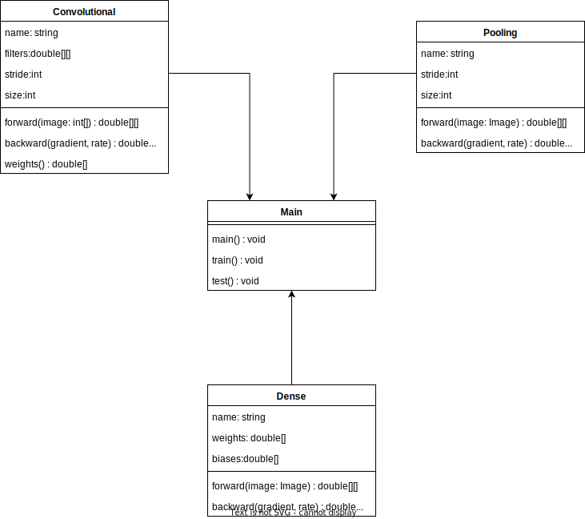

# Design
## Konsole
### Training
#### Input
`ki --training "[trainings.ubyte]"`
#### Output
Nach jedem Datensatz wird angezeigt wie viele der zum Training gegebenen Daten bereits abgearbeitet wurden.
### Test
#### Input
`ki --test "[test.ubyte]"`
#### Output
Nach jedem Datensatz wird angezeigt wie viele der zum Testen gegebenen Daten bereits abgearbeitet wurden.
Zudem wird angezeigt wie viele der Datensatze Richtig bzw. Falsch erkannt wurden.
### Anwendung
#### Input
`ki "[image.jpg]"`
#### Output
Als Output werden alle Ziffern von 0 bis 9 mit den entsprechenden Prozentwerten zurückgegeben (Dies kommt daher, dass die KI die Wahrscheinlichkeit der Übereinstimmung für jede Ziffer berechnet.).
Zudem wird auch angezeigt, welche Ziffer die höchste Übereinstimmung hat. Da diese die erkannte Ziffer darstellt.
## Datenbank
Die Applikation benötigt keine Applikation.
## Code
### Klassendiagramm
Es gibt drei Klassen in CKi (Convolutional Layer, Pooling Layer, Dense Layers).
Ein Convolutional Layer ist eine Art von Filter, welcher auf das Bild gelegt wird, um eine vereinfachte Erkennung zu ermöglichen.
Die Pooling Layers sind verantwortlich das Bild zu verkleinern und so eine schnellere Verarbeitung zu ermöglichen.
Die Dense Layers oder auch Fully Connected Layers sind das eingentlich das Gehirn der KI.
Zusätzlich gibt es die Main-Klasse, diese ist zuständig die oben genannten Klassen miteinander zu verbinden und so das Netzwerk aufzubauen. Zusätzlich handhabt es die Nutzereingaben und die Auslese der Trainings-/Testdaten.

## Trainingsdaten
Die Trainingsdaten sind das MNIST-Datenset mit den handschriftlichen Zahlen.
[Datenset]("http://yann.lecun.com/exdb/mnist/")
## Tests
Im Projekt CKI gibt es drei Arten von Tests. Es gibt das simple Ausprobieren. Da es nicht allzu viele Nutzerschnittstellen gibt, kann man diese ausführen und begutachten, ob diese mit der Beschreibung übereinstimmen.
Bei einer dieser Schnittstellen wird die KI getestet. Dies geschieht, indem der KI ihr unbekannte Datensätze zu sehen bekommt und das Endergebnis mit einem vordefinierten Ergebnis abgeglichen wird.
Egal ob das Ergebnis korrekt oder inkorrekt erkannt worden ist, wird es statistisch aufgenommen. Am Ende wird dem Nutzer eine Prozentzahl der korrekten Erkennungen präsentiert. Diesbezüglich ist dies
kein Test, in dem die Applikation versagen könnte, es ist eine reine Leistungsüberprüfung, ob mehr Training vonnöten ist.
Zusätzlich zu diesen zwei Testmöglichkeiten gibt es noch die Unit-Tests. Diese werden dazu genützt, um einzelne Funktionen und Klassen noch vor deren Verwendung zu überprüfen.
