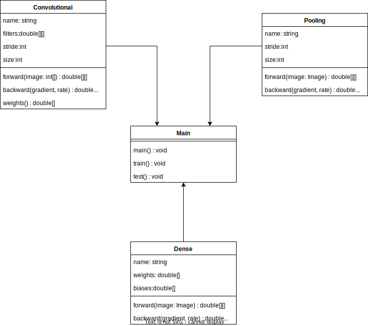

# Design
## Konsole
### Training
`ki --training "[trainings.ubyte]"`
### Test
`ki --test "[test.ubyte]"`
### Anwendung
`ki "[image.jpg]"`
## Datenbank
Die Applikation benötigt keine Applikation.
## Code
### Klassendiagramm
Es gibt drei Klassen in CKi (Convolutional Layer, Pooling Layer, Dense Layers).
Ein Convolutional Layer ist eine Art von Filter, welcher auf das Bild gelegt wird, um eine vereinfachte Erkennung zu ermöglichen.
Die Pooling Layers sind verantwortlich das Bild zu verkleinern und so eine schnellere Verarbeitung zu ermöglichen.
Die Dense Layers oder auch Fully Connected Layers sind das eingentlich das Gehirn der KI.
Zusätzlich gibt es die Main-Klasse, diese ist zuständig die oben genannten Klassen miteinander zu verbinden und so das Netzwerk aufzubauen. Zusätzlich handhabt es die Nutzereingaben und die Auslese der Trainings-/Testdaten.

## Trainingsdaten
Die Trainingsdaten sind das MNIST-Datenset mit den handschriftlichen Zahlen.
[Datenset]("http://yann.lecun.com/exdb/mnist/")
## Tests
